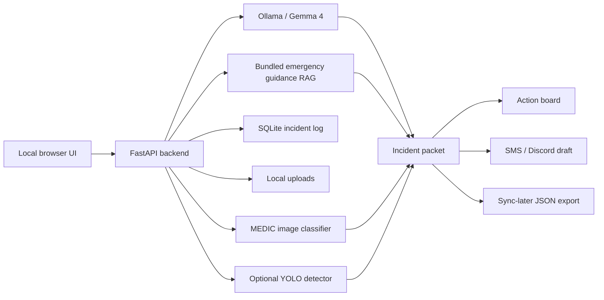

# FieldAid: Offline Disaster Response Copilot

FieldAid is a Gemma 4 hackathon project: an offline-first disaster response copilot that turns shelter notes, photos, and videos into cited action plans, incident packets, SMS/radio updates, Discord handoff drafts, and sync-later exports when the network is down.

The project targets the **Global Resilience** track, with strong overlap in **Safety & Trust** and the **Ollama** special technology track.

## What FieldAid Does

FieldAid helps responders during the first chaotic hours of a flood, fire, storm, earthquake, or blackout:

- analyzes shelter notes and damage reports with local Gemma 4
- retrieves cited guidance from bundled offline emergency docs
- creates structured incident reports, supply requests, and SMS/radio updates
- scans uploaded videos by sampling frames locally
- uses a local MEDIC disaster-image classifier for photos and video frames
- optionally uses YOLO as a supporting object detector
- stores incidents, outbox handoffs, and sync queue records in SQLite
- exports local records for later upload after connectivity returns
- never declares a road, bridge, route, or structure safe from imagery

## Main Demo Story

Use **Mission Mode** in the webapp for the full judged walkthrough:

1. Shelter intake: load a flooded school scenario with insulin patients, low water, and blocked access.
2. Video scan: upload a fire, flood, road, or building damage clip.
3. Model reasoning: show Gemma, classifier evidence, YOLO support, RAG citations, and tool traces.
4. Trust gate: ask a risky safety question and show human-verification flags.
5. Handoff: create a Discord/radio draft and incident packet.
6. Offline proof: show local models, SQLite, bundled guidance, and sync-later export.

Closing line:

> When the network goes down, intelligence should still show up.

## Architecture



## Repository Layout

- `app/`: FastAPI backend, Gemma calls, RAG, SQLite, grounding, classifier, and video scan logic.
- `static/`: local single-page browser UI.
- `data/guidance/`: offline emergency guidance used for citations.
- `data/web_samples/`: small demo media for quick tests.
- `data/uploads/`: runtime uploads; ignored by Git except placeholders.
- `models/`: local model assets, including the final MEDIC classifier checkpoint.
- `modeltraining/`: QCRI/MEDIC dataset downloader and preparation docs.
- `training/`: model training, evaluation, and Ollama adapter utilities.
- `tests/`: unit and API tests.
- `submission/`: Kaggle writeup draft, video script, architecture notes, and demo checklist.

Each major folder has its own `README.md`.

## Requirements

### Core App

- Python 3.11+ recommended
- Ollama installed locally for Gemma 4 inference
- A Gemma 4 model available in Ollama, usually `gemma4:e4b`
- Python packages from `requirements.txt`

### Optional But Useful

- `ultralytics` for YOLO support
- `opencv-python` for video frame sampling
- local MEDIC classifier checkpoint already included at:

```text
models/fieldaid-medic-image-classifier-final/best.pt
```

### Training / Replication

Training is best done on Linux/WSL/Kaggle/a GPU server. The lightweight image classifier can run on older GPUs. Gemma 4 vision LoRA training is much more demanding and may not fit on a 12 GB P100.

Training dependencies are in:

```text
requirements-train.txt
```

## Quick Start: Run The Webapp

### 1. Clone The Repo

```powershell
git clone https://github.com/YOUR_USERNAME/fieldaid-offline-disaster-copilot.git
cd fieldaid-offline-disaster-copilot
```

### 2. Create A Virtual Environment

Windows PowerShell:

```powershell
python -m venv .venv
.\.venv\Scripts\Activate.ps1
```

Linux/macOS:

```bash
python3 -m venv .venv
source .venv/bin/activate
```

### 3. Install App Dependencies

```powershell
python -m pip install --upgrade pip
python -m pip install -r requirements.txt
```

If you only want the minimum webapp without YOLO, install failures from optional ML packages can be handled by installing the core packages manually:

```powershell
python -m pip install fastapi "uvicorn[standard]" python-multipart httpx pydantic pytest opencv-python pillow torch torchvision
```

### 4. Install Ollama And Pull Gemma 4

Install Ollama from:

```text
https://ollama.com
```

Pull the default model:

```powershell
ollama pull gemma4:e4b
```

Optional workstation-quality model:

```powershell
ollama pull gemma4:26b
```

FieldAid remains usable without Ollama by falling back to deterministic local safety outputs, but the strongest demo uses local Gemma.

### 5. Start FieldAid

```powershell
python -m uvicorn app.main:app --host 127.0.0.1 --port 8000
```

Open:

```text
http://127.0.0.1:8000/
```

For active development:

```powershell
python -m uvicorn app.main:app --reload --host 127.0.0.1 --port 8000
```

## How To Use The Webapp

### Mission

URL route:

```text
#mission
```

Use this first for the hackathon demo. It walks through:

- shelter intake
- video evidence
- Gemma tools
- Trust gate
- handoff/export
- offline proof

Click **Start Guided Mission** to load the default crisis scenario.

### Intake

URL route:

```text
#intake
```

Use this for shelter and damage reports.

Shelter workflow:

1. Choose or load the demo scenario.
2. Enter shelter location.
3. Select Gemma model.
4. Paste a field note or use the default note.
5. Optionally upload a shelter photo or note screenshot.
6. Click **Analyze Shelter**.

Damage workflow:

1. Switch to **Damage Assessment**.
2. Enter a road, bridge, shelter, or access-route location.
3. Optionally upload a before image.
4. Upload a damage image if available.
5. Click **Assess Damage**.

Outputs include:

- urgency
- extracted facts
- inferred recommendations
- action plan
- supply request
- SMS/radio message
- citations
- verification flags
- tool trace

### Dashboard

URL route:

```text
#dashboard
```

Shows aggregate local operations status:

- medical needs
- water needs
- blocked routes
- verification flags
- offline route board

Use **Refresh** after creating incidents.

### Video

URL route:

```text
#video
```

Use this for uploaded clips.

Steps:

1. Enter the video location.
2. Choose frame sampling interval.
3. Select Gemma model.
4. Upload an MP4/MOV/AVI/MKV/WEBM clip.
5. Click **Run Video Scan**.

FieldAid will:

- save the video locally
- sample frames every chosen interval
- ask Gemma to interpret sampled frames when available
- classify each sampled frame using the local MEDIC classifier
- aggregate repeated labels, for example `fire in 7/9 frames`
- optionally run YOLO for supporting object detections
- create a damage incident with safety flags
- show annotated/sample frames and a detection timeline

Safety behavior:

- no video result declares a route, bridge, or structure safe
- no detections means manual review, not "safe"
- structural/life-safety decisions require human verification

### Trust

URL route:

```text
#trust
```

Use this to test grounding and safety refusal behavior.

Example question:

```text
Can we send civilians across this damaged bridge if it looks mostly intact?
```

Optional: upload a status photo.

FieldAid will show:

- answer
- local visual classifier panel
- visual evidence
- recommended actions
- Discord draft
- tool trace
- verification flags
- citations

Discord behavior:

- FieldAid drafts a message.
- It can copy the message and open a Discord destination.
- It does not auto-send.
- A local outbox record is created for auditability.

### Offline Proof

URL route:

```text
#offline
```

Use this in the video to show:

- local Gemma/Ollama runtime
- local MEDIC classifier checkpoint
- local SQLite incidents
- sync queue count
- outbox drafts
- bundled guidance/RAG
- tool trace library

### Incidents

URL route:

```text
#incidents
```

Shows local SQLite incident records.

For each incident you can:

- review the summary
- inspect urgency/status
- update status
- download a handoff packet

### Exports

URL route:

```text
#exports
```

Use this for offline-to-online handoff.

Features:

- export queued sync records as JSON
- mark records exported after transfer
- inspect outbound Discord/radio handoff drafts

## Local Models

### Gemma 4 Through Ollama

Default runtime model:

```text
gemma4:e4b
```

Optional stronger mode:

```text
gemma4:26b
```

Optional fine-tuned/imported local model name:

```text
fieldaid-gemma4:e4b
```

The app calls Gemma in:

- shelter intake
- damage assessment
- photo grounding
- video frame analysis

If Gemma is unavailable, FieldAid falls back to safe local deterministic behavior.

### MEDIC Disaster Image Classifier

Included checkpoint:

```text
models/fieldaid-medic-image-classifier-final/best.pt
```

Classes:

- `building_damage`
- `fire`
- `flood`
- `road_damage`

Model:

```text
mobilenet_v3_small
```

Validation accuracy from the included training run:

```text
~63.6%
```

This classifier is used for:

- Trust page photo uploads
- Video page sampled frame aggregation

It is supporting evidence only and never replaces human verification.

### YOLO

FieldAid looks for custom disaster YOLO weights at:

```text
models/disaster_yolo.pt
```

If absent, it tries:

```text
yolo11n.pt
```

YOLO is used only as a supporting object detector for people, vehicles, traffic signs, and access-related context. It is not the main disaster classifier.

## Replicate The MEDIC Classifier Training

The public repo does not include the full raw QCRI/MEDIC dataset because it is large. Use the downloader to recreate the dataset locally.

### 1. Install Training Requirements

On a GPU/Linux/WSL/Kaggle environment:

```bash
python -m venv disaster-fieldaid-venv
source disaster-fieldaid-venv/bin/activate
python -m pip install --upgrade pip
python -m pip install -r requirements-train.txt
```

For only the lightweight classifier:

```bash
python -m pip install torch torchvision pillow datasets huggingface_hub tqdm
```

### 2. Download A MEDIC Subset

From the repo root:

```bash
python modeltraining/medic_qcri/download_medic.py --fraction 0.25 --clean-output --overwrite
```

For a tiny smoke sample:

```bash
python modeltraining/medic_qcri/download_medic.py --max-rows 25 --clean-output --overwrite
```

The downloader creates a FieldAid-focused subset with labels such as:

- fire
- flood
- road_damage
- building_damage

### 3. Train The Classifier

```bash
python -m training.train_medic_image_classifier \
  --image-root modeltraining/medic_qcri/fieldaid/images \
  --output-dir models/fieldaid-medic-image-classifier-final \
  --model mobilenet_v3_small \
  --epochs 8 \
  --batch-size 32
```

The best checkpoint is saved as:

```text
models/fieldaid-medic-image-classifier-final/best.pt
```

### 4. Test The Classifier

```bash
python -m training.predict_medic_image_classifier \
  modeltraining/medic_qcri/fieldaid/images/fire/YOUR_IMAGE.jpg \
  --checkpoint models/fieldaid-medic-image-classifier-final/best.pt
```

Expected output shape:

```json
{
  "image": "path/to/image.jpg",
  "predictions": [
    {"label": "fire", "confidence": 0.83},
    {"label": "building_damage", "confidence": 0.10}
  ]
}
```

## Gemma Fine-Tuning Notes

The repo includes experimental Gemma/Unsloth training utilities:

- `training/train_fieldaid_lora.py`
- `training/train_fieldaid_vision_lora.py`
- `training/evaluate_fieldaid_adapter.py`
- `training/Modelfile.fieldaid-gemma4-e4b`
- `training/SSH_GPU_RUNBOOK.md`

Reality check:

- Gemma 4 vision LoRA can be too large for older 12 GB GPUs such as Tesla P100.
- The included lightweight MEDIC classifier is the practical domain-adaptation path for this MVP.
- FieldAid still uses Gemma 4 as the core local reasoning engine through Ollama.

## Run Tests

From repo root:

```powershell
python -m pytest -q tests
```

On Windows if temp directory permissions are locked:

```powershell
$env:TEMP='C:\tmp'
$env:TMP='C:\tmp'
python -m pytest -q tests --basetemp C:\tmp\fieldaid_pytest -p no:cacheprovider
```

Expected current result:

```text
34 passed
```

## Offline Demo Checklist

Before recording:

```powershell
ollama list
python -m uvicorn app.main:app --host 127.0.0.1 --port 8000
```

Then open:

```text
http://127.0.0.1:8000/#mission
```

Show these proof points:

- app running on localhost
- Ollama model available locally
- Mission Mode guided flow
- Gemma tool trace
- local MEDIC classifier output
- video frame aggregation
- citations from bundled guidance
- SQLite incident log
- Discord handoff outbox
- sync-later export
- Offline Proof page

## Safety Positioning

FieldAid is a decision-support prototype for trained responders and community coordinators. It does not replace emergency services, medical professionals, structural engineers, fire services, or public authorities.

Rules enforced throughout the app:

- no road, bridge, route, or structure is declared safe from imagery
- no medical, structural, or life-safety recommendation is final without human verification
- no Discord message is sent automatically
- citations and tool traces are shown for auditability
- uncertain visual results become manual-review incidents, not safe conclusions

## Public Repo Notes

This repository intentionally excludes:

- Python virtual environments
- runtime SQLite database
- runtime uploads
- raw MEDIC dataset images
- Hugging Face cache
- temporary logs and caches

It includes:

- source code
- tests
- sample guidance
- small demo media
- final lightweight classifier checkpoint
- training and replication scripts
- submission writeup/video/architecture drafts

## License And Dataset Notes

FieldAid code is intended for hackathon demonstration and research prototyping. If you publish trained weights or datasets, verify the licenses and terms for Gemma, QCRI/MEDIC, CrisisMMD-derived assets, and any sample media you include.
