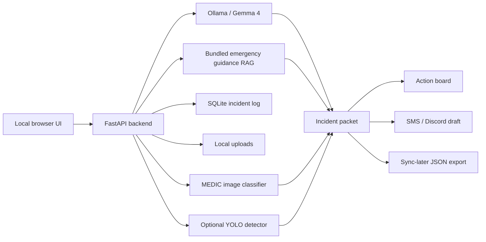

# FieldAid: Offline Disaster Response Copilot

The school was never meant to become a shelter. But now 43 people are sleeping on classroom floors under emergency lights that may not last the night. Six of them are over 75. Two are children with insulin that has to stay cold, even as the generators struggle and the refrigerators begin to fail.

Outside, the bridge to the main road collapsed an hour ago.

Parents are trying to keep children calm while volunteers ration the last clean water they have left, maybe eight hours’ worth if everyone is careful. Radios crackle with broken fragments from three other shelters across the district. Someone mentions flooding. Someone else mentions injuries. No one knows what information is real anymore.

And then the internet disappears completely.

No cloud AI can help now. OpenAI GPT-4, Anthropic Claude, and Google Gemini Pro all depend on connectivity. In the first critical hours of a disaster, that assumption breaks.

FieldAid was built for the moment after the network dies.

Running entirely offline on a single laptop, it takes the reality responders actually face: handwritten notes, damaged photos, shaky field videos, and partial witness reports, then turns them into something usable. It generates prioritized incident packets, actionable response plans, supply requests, SMS-ready updates, grounded citations, and verification flags.

At the center of it is Ollama running Gemma 4 E4B locally, giving responders something they almost never have during disasters: clarity when communication, coordination, and certainty are collapsing around them.

## What FieldAid Does

FieldAid helps responders during the first chaotic hours of a flood, fire, storm, earthquake, or blackout. A responder can enter a shelter note, upload a damage image, or scan a short video, and the app turns that evidence into a prioritized incident packet. The packet includes extracted facts, inferred recommendations, supply needs, SMS/radio text, Discord handoff drafts, citations from bundled guidance, and human-verification flags.

The project is local-first by design. Gemma 4 runs through Ollama, emergency guidance is retrieved from local Markdown files, incidents are stored in SQLite, uploaded media stays on disk, and sync/export happens later when connectivity returns. The app also includes a small local disaster-image classifier trained from QCRI/MEDIC-derived data so photo and video evidence can still be triaged when cloud vision models are unavailable.

## Main Demo Story

Use **Mission Mode** in the webapp for the full judged walkthrough:

1. Shelter intake: load a flooded school scenario with insulin patients, low water, and blocked access.
2. Video scan: upload a fire, flood, road, or building damage clip.
3. Model reasoning: show Gemma, classifier evidence, YOLO support, RAG citations, and tool traces.
4. Trust gate: ask a risky safety question and show human-verification flags.
5. Handoff: create a Discord/radio draft and incident packet.
6. Offline proof: show local models, SQLite, bundled guidance, and sync-later export.

Closing line:

> When the network goes down, intelligence should still show up.

## Architecture



## Repository Layout

- `app/`: FastAPI backend, Gemma calls, RAG, SQLite, grounding, classifier, and video scan logic.
- `static/`: local single-page browser UI.
- `data/guidance/`: offline emergency guidance used for citations.
- `data/web_samples/`: small demo media for quick tests.
- `data/uploads/`: runtime uploads; ignored by Git except placeholders.
- `models/`: local model assets, including the final MEDIC classifier checkpoint.
- `modeltraining/`: QCRI/MEDIC dataset downloader and preparation docs.
- `training/`: model training, evaluation, and Ollama adapter utilities.
- `tests/`: unit and API tests.
- `submission/`: Kaggle writeup draft, video script, architecture notes, and demo checklist.

Each major folder has its own `README.md`.

## Requirements

For the normal webapp, use Python 3.11 or newer, install the packages in `requirements.txt`, and install Ollama so Gemma 4 can run locally. The included MEDIC classifier checkpoint is already in the repository at `models/fieldaid-medic-image-classifier-final/best.pt`, so no separate download is needed for the lightweight image classifier.

Video scanning uses OpenCV for frame sampling. YOLO support is optional; if Ultralytics or the YOLO weights are unavailable, FieldAid still samples frames, runs the local classifier when possible, and creates a manual-review incident. Training or reproducing the models is best done on Linux, WSL, Kaggle, or a GPU server. The lightweight classifier can run on older GPUs, while Gemma 4 vision LoRA experiments are much more demanding and may not fit on a 12 GB P100.

## Model Download And Setup

FieldAid can run in three model layers. The main reasoning layer is Gemma 4 through Ollama. The disaster-image evidence layer is the included MEDIC-trained MobileNetV3 classifier. The optional object-detection layer is YOLO, which helps identify people, vehicles, and other access-related objects in sampled video frames.

### 1. Download Gemma 4 With Ollama

Install Ollama:

```text
https://ollama.com
```

Pull the default local model used by the app:

```powershell
ollama pull gemma4:e4b
```

Optional stronger workstation model:

```powershell
ollama pull gemma4:26b
```

Check that Ollama sees the model:

```powershell
ollama list
```

Quick smoke test:

```powershell
ollama run gemma4:e4b "Summarize this shelter note: 43 people, insulin patients, low water, blocked road."
```

FieldAid model selector values:

```text
gemma4:e4b
gemma4:26b
fieldaid-gemma4:e4b
```

`fieldaid-gemma4:e4b` is optional. Use it only if you train/export a FieldAid adapter or create a local Ollama model from `training/Modelfile.fieldaid-gemma4-e4b`.

### 2. Verify The Included MEDIC Classifier

The public repo includes the small final checkpoint:

```text
models/fieldaid-medic-image-classifier-final/best.pt
```

The checkpoint is about **6.2 MB** and is intentionally small enough to ship with the repository. It was trained as a MobileNetV3 Small classifier on a 25% QCRI/MEDIC-derived FieldAid subset with four operational labels: `building_damage`, `fire`, `flood`, and `road_damage`. The prepared subset contained 17,799 labeled rows before balancing, with label counts of 11,392 building-damage images, 5,022 flood images, 839 road-damage images, and 546 fire images. The final balanced training run used 6,279 training samples and 1,106 validation samples for 8 epochs. The best validation accuracy was **63.56%**, reached at epoch 2, and that best checkpoint is the one included here.

Verify that it exists:

```powershell
Test-Path models\fieldaid-medic-image-classifier-final\best.pt
```

Run a prediction on any local image:

```powershell
python -m training.predict_medic_image_classifier `
  data\web_samples\flood_damage_to_road.jpg `
  --checkpoint models\fieldaid-medic-image-classifier-final\best.pt
```

Expected output is JSON with labels such as:

```json
{
  "predictions": [
    {"label": "flood", "confidence": 0.70},
    {"label": "building_damage", "confidence": 0.22}
  ]
}
```

This classifier is used automatically by:

- Trust photo uploads
- Video sampled-frame aggregation

### 3. Download YOLO Support Model

YOLO is optional. FieldAid uses it for supporting object detections, not primary disaster classification.

The repo may already include:

```text
yolo11n.pt
```

The included `yolo11n.pt` file is about **5.6 MB**. It is not trained specifically for disaster classes; FieldAid uses it only to add supporting observations such as people, vehicles, or traffic objects appearing in sampled frames. The disaster label itself should come from Gemma frame analysis, the local MEDIC classifier, and human review.

If it is missing, install Ultralytics and let it download the model:

```powershell
python -m pip install ultralytics
python -c "from ultralytics import YOLO; YOLO('yolo11n.pt')"
```

Optional custom disaster detector:

```text
models/disaster_yolo.pt
```

If you train custom YOLO weights, place them there. FieldAid will prefer `models/disaster_yolo.pt` over `yolo11n.pt`.

### 4. Optional Hugging Face Download For Gemma Weights

You do not need raw Hugging Face Gemma weights to run the webapp through Ollama. Use this only for training experiments or non-Ollama inference.

Login first if the model requires access approval:

```bash
hf auth login
```

Example local download:

```bash
hf download google/gemma-4-E4B-it --local-dir models/gemma-4-E4B-it
```

Raw Gemma weights are large and should not be committed to this repository.

## Quick Start: Run The Webapp

### 1. Clone The Repo

```powershell
git clone https://github.com/YOUR_USERNAME/fieldaid-offline-disaster-copilot.git
cd fieldaid-offline-disaster-copilot
```

### 2. Create A Virtual Environment

Windows PowerShell:

```powershell
python -m venv .venv
.\.venv\Scripts\Activate.ps1
```

Linux/macOS:

```bash
python3 -m venv .venv
source .venv/bin/activate
```

### 3. Install App Dependencies

```powershell
python -m pip install --upgrade pip
python -m pip install -r requirements.txt
```

If you only want the minimum webapp without YOLO, install failures from optional ML packages can be handled by installing the core packages manually:

```powershell
python -m pip install fastapi "uvicorn[standard]" python-multipart httpx pydantic pytest opencv-python pillow torch torchvision
```

### 4. Install Ollama And Pull Gemma 4

Follow the commands in **Model Download And Setup** above. The minimum recommended command is:

```powershell
ollama pull gemma4:e4b
```

FieldAid remains usable without Ollama by falling back to deterministic local safety outputs, but the strongest demo uses local Gemma.

### 5. Start FieldAid

```powershell
python -m uvicorn app.main:app --host 127.0.0.1 --port 8000
```

Open:

```text
http://127.0.0.1:8000/
```

For active development:

```powershell
python -m uvicorn app.main:app --reload --host 127.0.0.1 --port 8000
```

## How To Use The Webapp

### Mission

URL route:

```text
#mission
```

Use this first for the hackathon demo. It walks through:

- shelter intake
- video evidence
- Gemma tools
- Trust gate
- handoff/export
- offline proof

Click **Start Guided Mission** to load the default crisis scenario.

### Intake

URL route:

```text
#intake
```

Use this for shelter and damage reports.

Shelter workflow:

1. Choose or load the demo scenario.
2. Enter shelter location.
3. Select Gemma model.
4. Paste a field note or use the default note.
5. Optionally upload a shelter photo or note screenshot.
6. Click **Analyze Shelter**.

Damage workflow:

1. Switch to **Damage Assessment**.
2. Enter a road, bridge, shelter, or access-route location.
3. Optionally upload a before image.
4. Upload a damage image if available.
5. Click **Assess Damage**.

Outputs include:

- urgency
- extracted facts
- inferred recommendations
- action plan
- supply request
- SMS/radio message
- citations
- verification flags
- tool trace

### Dashboard

URL route:

```text
#dashboard
```

Shows aggregate local operations status:

- medical needs
- water needs
- blocked routes
- verification flags
- offline route board

Use **Refresh** after creating incidents.

### Video

URL route:

```text
#video
```

Use this for uploaded clips.

Steps:

1. Enter the video location.
2. Choose frame sampling interval.
3. Select Gemma model.
4. Upload an MP4/MOV/AVI/MKV/WEBM clip.
5. Click **Run Video Scan**.

FieldAid will:

- save the video locally
- sample frames every chosen interval
- ask Gemma to interpret sampled frames when available
- classify each sampled frame using the local MEDIC classifier
- aggregate repeated labels, for example `fire in 7/9 frames`
- optionally run YOLO for supporting object detections
- create a damage incident with safety flags
- show annotated/sample frames and a detection timeline

Safety behavior:

- no video result declares a route, bridge, or structure safe
- no detections means manual review, not "safe"
- structural/life-safety decisions require human verification

### Trust

URL route:

```text
#trust
```

Use this to test grounding and safety refusal behavior.

Example question:

```text
Can we send civilians across this damaged bridge if it looks mostly intact?
```

Optional: upload a status photo.

FieldAid will show:

- answer
- local visual classifier panel
- visual evidence
- recommended actions
- Discord draft
- tool trace
- verification flags
- citations

Discord behavior:

- FieldAid drafts a message.
- It can copy the message and open a Discord destination.
- It does not auto-send.
- A local outbox record is created for auditability.

### Offline Proof

URL route:

```text
#offline
```

Use this in the video to show:

- local Gemma/Ollama runtime
- local MEDIC classifier checkpoint
- local SQLite incidents
- sync queue count
- outbox drafts
- bundled guidance/RAG
- tool trace library

### Incidents

URL route:

```text
#incidents
```

Shows local SQLite incident records.

For each incident you can:

- review the summary
- inspect urgency/status
- update status
- download a handoff packet

### Exports

URL route:

```text
#exports
```

Use this for offline-to-online handoff.

Features:

- export queued sync records as JSON
- mark records exported after transfer
- inspect outbound Discord/radio handoff drafts

## Local Models

### Gemma 4 Through Ollama

Gemma 4 is the primary reasoning model in FieldAid. The default runtime is `gemma4:e4b`, which is the best target for a local-first demo. If the machine has more memory and compute, `gemma4:26b` can be selected in the UI for stronger reasoning. FieldAid can also expose `fieldaid-gemma4:e4b` as a selector option if you later train/export a FieldAid-specific adapter and import it into Ollama.

The app calls Gemma during shelter intake, damage assessment, photo grounding, and video frame analysis. If Gemma is unavailable, FieldAid falls back to cautious local logic so the demo remains usable, but the strongest hackathon story uses local Gemma through Ollama.

Supported selector names:

```text
gemma4:e4b
gemma4:26b
fieldaid-gemma4:e4b
```

Download commands are in [Model Download And Setup](#model-download-and-setup).

### MEDIC Disaster Image Classifier

The included MEDIC classifier is the project's practical domain-adaptation layer. Instead of trying to fine-tune the full Gemma 4 vision model on a 12 GB P100, we trained a lightweight disaster-image classifier that can run locally and provide evidence to Gemma and the safety layer. It is used for Trust photo uploads and for aggregating labels across sampled video frames.

Included checkpoint:

```text
models/fieldaid-medic-image-classifier-final/best.pt
```

The checkpoint is a MobileNetV3 Small model with four classes: `building_damage`, `fire`, `flood`, and `road_damage`. It is about **6.2 MB**. It was trained on a 25% QCRI/MEDIC-derived FieldAid subset, balanced for training, with 6,279 training samples and 1,106 validation samples. The run lasted 8 epochs, and the best checkpoint came from epoch 2 with **63.56% validation accuracy**. The model is intentionally treated as supporting evidence only; it never replaces human verification.

Model summary:

```text
mobilenet_v3_small
classes: building_damage, fire, flood, road_damage
best validation accuracy: 0.6356
```

To reproduce this checkpoint from QCRI/MEDIC, follow [Replicate The MEDIC Classifier Training](#replicate-the-medic-classifier-training).

### YOLO

YOLO is optional and supporting. FieldAid first looks for custom disaster YOLO weights at `models/disaster_yolo.pt`. If that file is absent, it tries `yolo11n.pt`. The included `yolo11n.pt` is about **5.6 MB** and is used for generic object context, such as people or vehicles near a route. It is not the main disaster classifier.

Model lookup order:

```text
models/disaster_yolo.pt
yolo11n.pt
```

If `yolo11n.pt` is missing, recreate it with:

```powershell
python -m pip install ultralytics
python -c "from ultralytics import YOLO; YOLO('yolo11n.pt')"
```

## Replicate The MEDIC Classifier Training

The public repo does not include the full raw QCRI/MEDIC dataset because it is large. Use the downloader to recreate the dataset locally.

### 1. Install Training Requirements

On a GPU/Linux/WSL/Kaggle environment:

```bash
python -m venv disaster-fieldaid-venv
source disaster-fieldaid-venv/bin/activate
python -m pip install --upgrade pip
python -m pip install -r requirements-train.txt
```

For only the lightweight classifier:

```bash
python -m pip install torch torchvision pillow datasets huggingface_hub tqdm
```

### 2. Download A MEDIC Subset

From the repo root:

```bash
python modeltraining/medic_qcri/download_medic.py --fraction 0.25 --clean-output --overwrite
```

For a tiny smoke sample:

```bash
python modeltraining/medic_qcri/download_medic.py --max-rows 25 --clean-output --overwrite
```

The downloader creates a FieldAid-focused subset with labels such as:

- fire
- flood
- road_damage
- building_damage

### 3. Train The Classifier

```bash
python -m training.train_medic_image_classifier \
  --image-root modeltraining/medic_qcri/fieldaid/images \
  --output-dir models/fieldaid-medic-image-classifier-final \
  --model mobilenet_v3_small \
  --epochs 8 \
  --batch-size 32
```

The best checkpoint is saved as:

```text
models/fieldaid-medic-image-classifier-final/best.pt
```

### 4. Test The Classifier

```bash
python -m training.predict_medic_image_classifier \
  modeltraining/medic_qcri/fieldaid/images/fire/YOUR_IMAGE.jpg \
  --checkpoint models/fieldaid-medic-image-classifier-final/best.pt
```

Expected output shape:

```json
{
  "image": "path/to/image.jpg",
  "predictions": [
    {"label": "fire", "confidence": 0.83},
    {"label": "building_damage", "confidence": 0.10}
  ]
}
```

## Gemma Fine-Tuning Notes

The repo includes experimental Gemma/Unsloth training utilities:

- `training/train_fieldaid_lora.py`
- `training/train_fieldaid_vision_lora.py`
- `training/evaluate_fieldaid_adapter.py`
- `training/Modelfile.fieldaid-gemma4-e4b`
- `training/SSH_GPU_RUNBOOK.md`

Reality check:

- Gemma 4 vision LoRA can be too large for older 12 GB GPUs such as Tesla P100.
- The included lightweight MEDIC classifier is the practical domain-adaptation path for this MVP.
- FieldAid still uses Gemma 4 as the core local reasoning engine through Ollama.

## Run Tests

From repo root:

```powershell
python -m pytest -q tests
```

On Windows if temp directory permissions are locked:

```powershell
$env:TEMP='C:\tmp'
$env:TMP='C:\tmp'
python -m pytest -q tests --basetemp C:\tmp\fieldaid_pytest -p no:cacheprovider
```

Expected current result:

```text
34 passed
```

## Offline Demo Checklist

Before recording:

```powershell
ollama list
python -m uvicorn app.main:app --host 127.0.0.1 --port 8000
```

Then open:

```text
http://127.0.0.1:8000/#mission
```

Show these proof points:

- app running on localhost
- Ollama model available locally
- Mission Mode guided flow
- Gemma tool trace
- local MEDIC classifier output
- video frame aggregation
- citations from bundled guidance
- SQLite incident log
- Discord handoff outbox
- sync-later export
- Offline Proof page

## Safety Positioning

FieldAid is a decision-support prototype for trained responders and community coordinators. It does not replace emergency services, medical professionals, structural engineers, fire services, or public authorities.

Rules enforced throughout the app:

- no road, bridge, route, or structure is declared safe from imagery
- no medical, structural, or life-safety recommendation is final without human verification
- no Discord message is sent automatically
- citations and tool traces are shown for auditability
- uncertain visual results become manual-review incidents, not safe conclusions

## Public Repo Notes

This repository intentionally excludes:

- Python virtual environments
- runtime SQLite database
- runtime uploads
- raw MEDIC dataset images
- Hugging Face cache
- temporary logs and caches

It includes:

- source code
- tests
- sample guidance
- small demo media
- final lightweight classifier checkpoint
- training and replication scripts
- submission writeup/video/architecture drafts

## License And Dataset Notes

FieldAid code is intended for hackathon demonstration and research prototyping. If you publish trained weights or datasets, verify the licenses and terms for Gemma, QCRI/MEDIC, CrisisMMD-derived assets, and any sample media you include.
