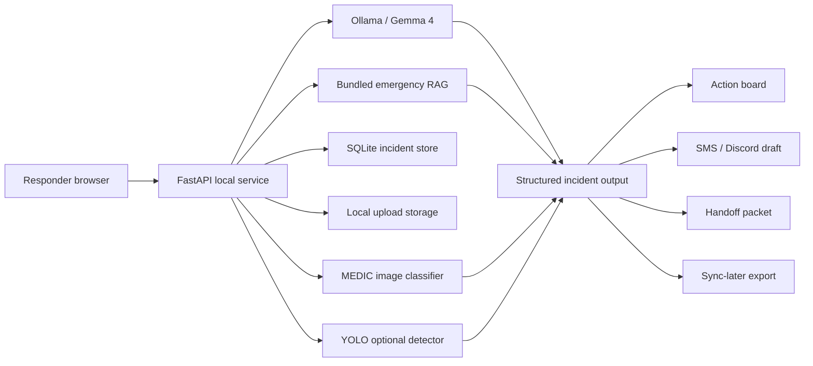

# FieldAid Architecture

## Local Components
- Browser UI: Mission Mode, Intake, Dashboard, Video, Trust, Offline Proof, Incidents, Exports.
- FastAPI backend: upload handling, analysis endpoints, sync/outbox APIs.
- Gemma 4 through Ollama: local reasoning and multimodal frame/photo interpretation.
- SQLite: incidents, status, sync queue, outbound handoff drafts.
- RAG: local emergency guidance snippets for grounded citations.
- MEDIC classifier: MobileNetV3 checkpoint for disaster image/frame evidence.
- YOLO: optional supporting object detector for people/vehicle/access observations.

## Safety Contract
- Never declare a route, bridge, or structure safe from imagery.
- Medical, fire, floodwater, structural, and life-safety outputs require human verification.
- Discord handoff is drafted and recorded, not auto-sent.
- No cloud endpoint is required after setup.
